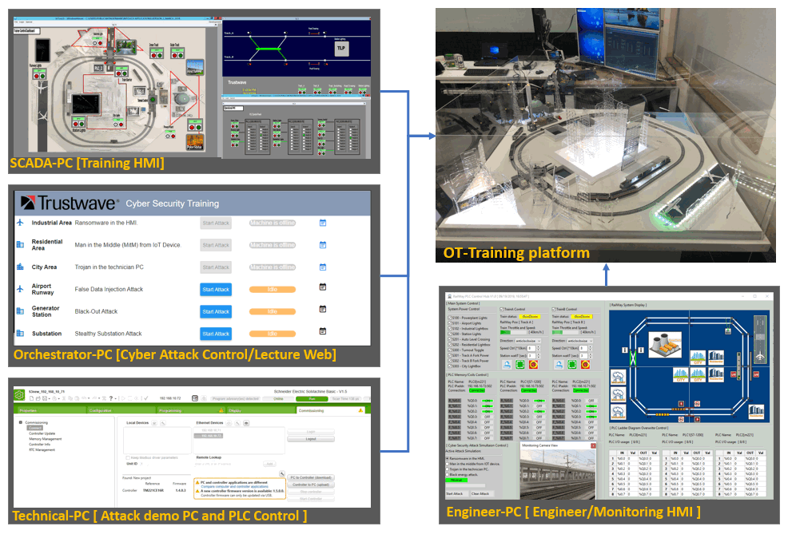
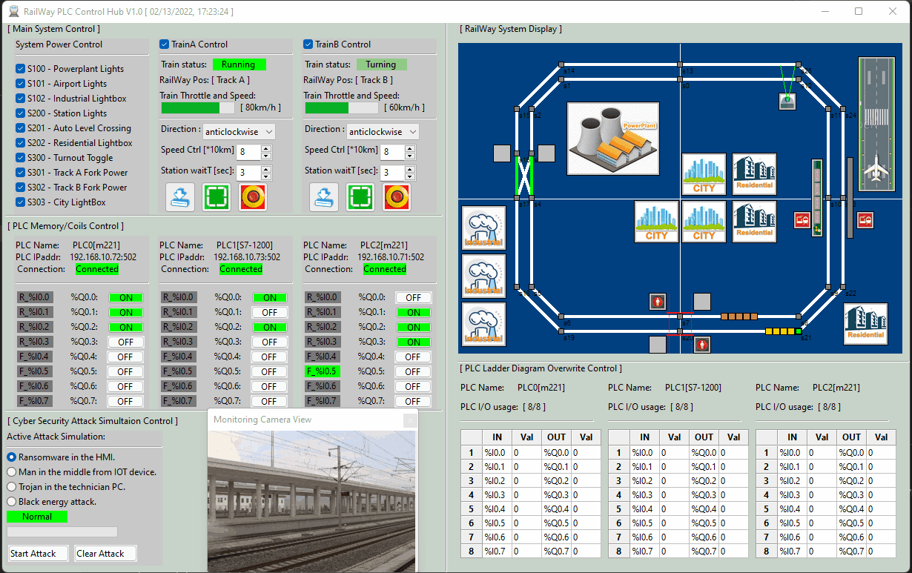
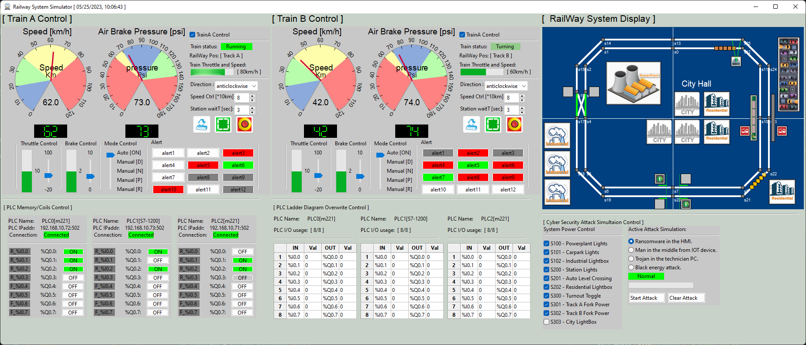
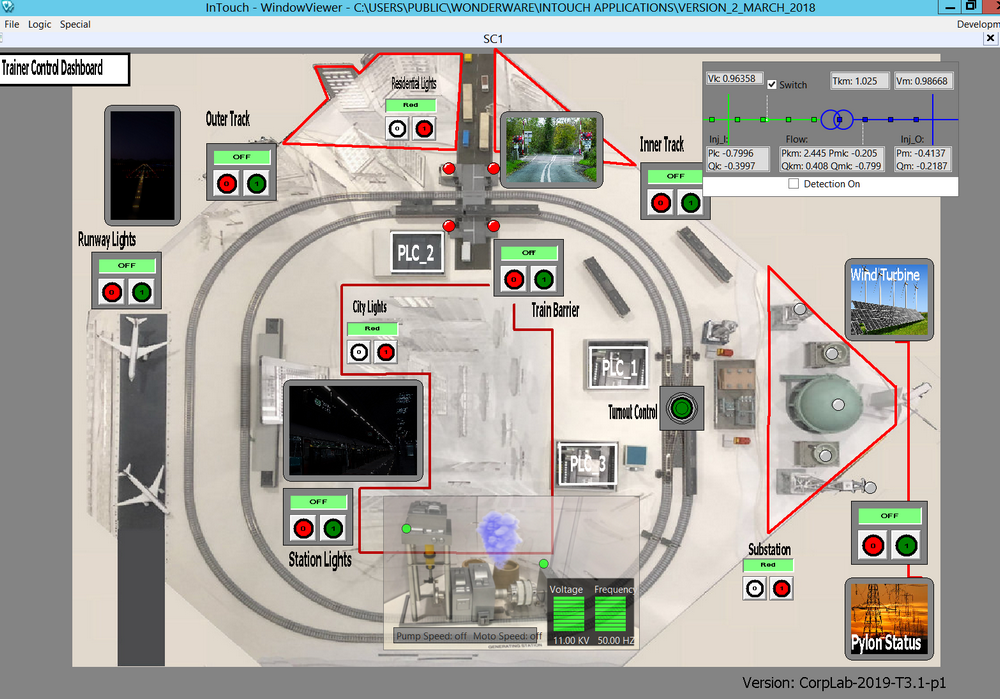
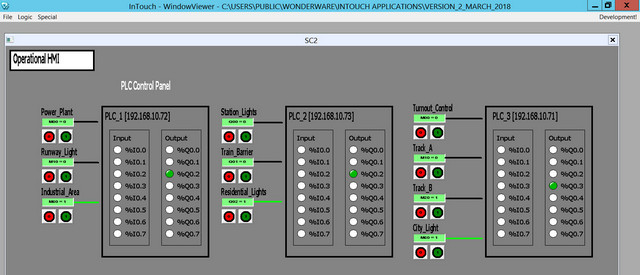
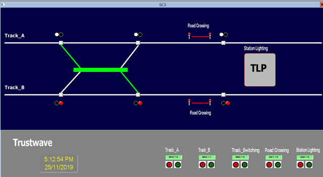
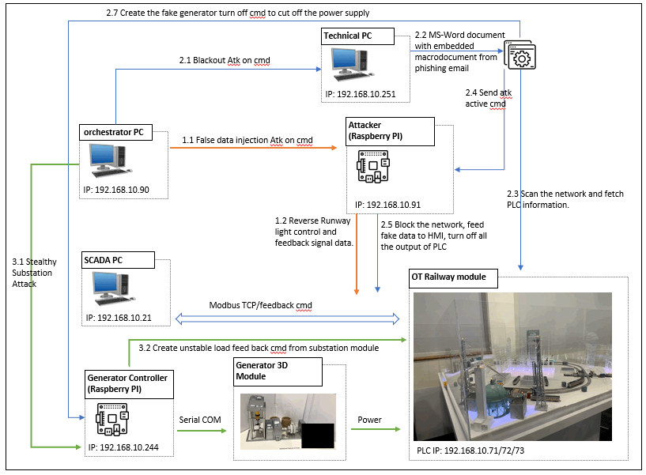
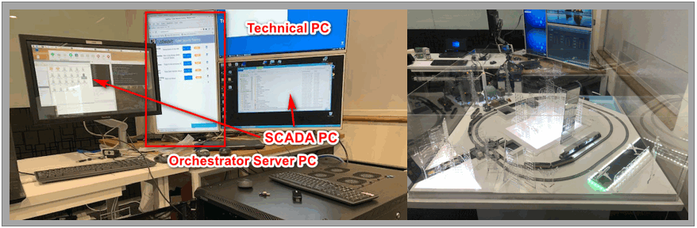
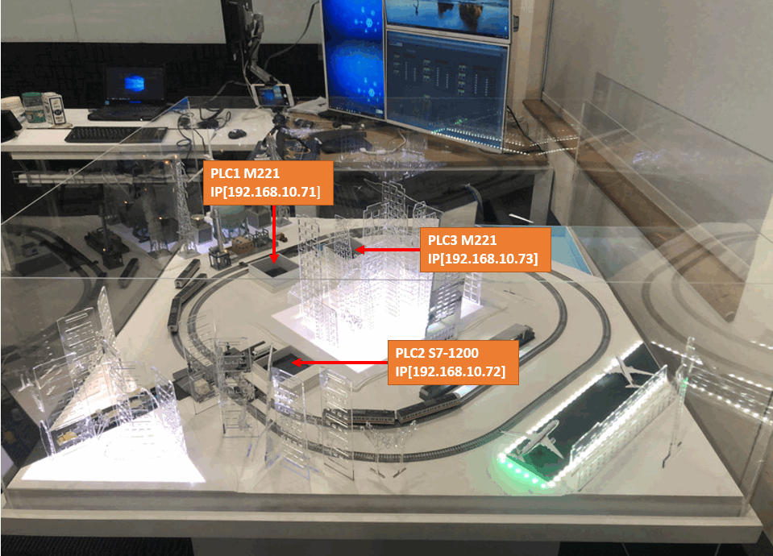

# Contrôle ferroviaire/attaque cybernétique OT

> Tous droits réservés par le laboratoire de recherche et développement en cybersécurité de NUS-Singtel (de juin 2016 à juin 2021)

**Objectif du programme : Nous souhaitons construire un système de simulation urbaine OT (Operational Technology) avec deux voies ferrées et créer deux types d'IHM (IHM de surveillance des ingénieurs et IHM de formation des enseignants) pour le contrôler. Nous souhaitons également utiliser ce système pour démontrer différents types de cyberattaques OT (Automate Programmable Opérationnel) en implémentant la fonction de simulation d'attaque correspondante. 

[TOC]

### Introduction

Ce projet consistera à implémenter une IHM pour les plateformes de simulation OT-3D-City et de gestion de l'énergie (générateur et sous-station). Nous démontrerons ensuite différents types de cyberattaques sur les deux plateformes. Le projet comprend quatre sections principales :

1. **Programme IHM du simulateur OT-City** : Dans cette section, nous allons créer un système IHM SCADA avec le programme Schneider Wonderware(R) exécuté sur le PC SCADA pour permettre à l'utilisateur de contrôler les modules du simulateur OT-3D-city à des fins de formation et de recherche. Nous créerons également une IHM de surveillance prête à l'emploi pour l'analyse du système et la détection des anomalies.
2. **  Simulation de cyberattaque sur la plateforme OT** : Dans cette section, nous allons illustrer trois types de cyberattaques sur la plateforme OT et le module de gestion de l'alimentation : l'attaque par injection de fausses données, l'attaque par black-out et l'attaque furtive. La démonstration sera activée par le site web de contrôle des attaques et lancée depuis un périphérique de contrôle des attaques (Raspberry PI) connecté au réseau du système. Lien de référence : https://github.com/LiuYuancheng/RailWay_PLC_Control/tree/master/attack/remoteAtk
3. **Site web de contrôle des cyberattaques OT** : Dans cette section, nous allons créer un serveur web exécuté sur le PC orchestrateur afin de fournir une interface web permettant à l'utilisateur de contrôler différentes démonstrations de cyberattaques sur la plateforme OT et d'afficher les retours système et les détails de l'attaque pendant la présentation. L'utilisateur activera/arrêtera la démonstration en se connectant à la page web de contrôle des attaques. Lien de référence : https://github.com/LiuYuancheng/OT_Platform_Attack_Web
4. **Gestionnaire de générateur et de sous-station OT-Cyber-Attack** : Nous fournirons une interface utilisateur sur le PC SCADA pour contrôler à distance le module générateur OT-Power. Nous fournirons un contrôleur de module composé d'un Raspberry PI et d'un Arduino pour recevoir les requêtes de contrôle de l'interface du contrôleur et modifier l'état des composants matériels du module générateur, tels que la pompe, le moteur et l'écran LED. Le programme de contrôle ajustera également automatiquement la vitesse du moteur et de la pompe du générateur en fonction des charges du système. Lien de référence : https://github.com/LiuYuancheng/Power_Generator_Manager

#### Diagramme de présentation du système

La relation entre les quatre sections principales est présentée dans le diagramme d'ensemble ci-dessous :



`version 2.1`


------

### Conception de systèmes/programmes

#### Conception d'une IHM de surveillance d'ingénieur

L'IHM de surveillance, installée sur l'ordinateur portable de l'ingénieur, permet à ce dernier de surveiller et de modifier tous les paramètres une fois connecté au système. L'utilisateur peut également exécuter l'IHM indépendamment pour simuler différentes situations de contrôle et trois types d'attaques de programme générales sans connexion au système. Ses principales fonctions sont les suivantes :

- Contrôler/simuler différents composants du système ferroviaire urbain et de 2 trains.
- Affichez le signal des bobines d'entrée/sortie PLC en temps réel ou simulez le changement de signal.
- Afficher l'état de la mémoire/du registre de l'API ou écraser ces données de l'API.
- Modifiez les paramètres du système et lancez différentes simulations de cyberattaques (attaques de type « Man in Mid », « Trojan » et « Ransomware »).

##### Vue de l'interface utilisateur IHM de surveillance de l'ingénieur

Interface utilisateur du contrôleur en mode normal :



Interface utilisateur du contrôleur en mode débogage :




#### Conception d'une IHM pour la formation des enseignants

La formation des enseignants en IHM fournira un programme d'interface homme-machine (IHM) de contrôle et d'acquisition de données (SCADA) pour contrôler les composants de la plateforme de démonstration de cyberattaque CSI OT-3D. Nous créerons deux types de systèmes IHM SCADA à l'aide du logiciel Schneider-Wonderware® et de Python pour permettre à l'utilisateur de contrôler les modules ferroviaires PLC ou de simuler différents types d'exploitation ferroviaire à des fins de formation ou de recherche.

##### Vue de l'interface utilisateur de l'IHM pour la formation des enseignants

Le programme IHM Schneider-Wonderware est principalement utilisé à des fins de démonstration, il contient trois pages principales :

- La page IHM SCADA de formation est principalement utilisée pour les tâches de formation et de démonstration.

  

- La page IHM d'affichage de l'état de l'API est utilisée pour afficher la logique de flux de travail des modules API du système.

  

- La page IHM de commandement et de contrôle ferroviaire est utilisée pour simuler et démontrer la séquence opérationnelle du centre de contrôle et de commandement ferroviaire.

  


#### Conception de simulation de cyberattaque OT

Le système proposera trois nouvelles démonstrations de cyberattaques sur la plateforme CSI OT Demo : « False Data Injection Attack », « Blackout Attack » et « Stealthy Situation Attack ». Le détail de l'attaque est disponible sur : https://github.com/LiuYuancheng/RailWay_PLC_Control/tree/master/attack/remoteAtk

##### Diagramme de flux de travail d'attaque




------

### Configuration du programme

###### Environnement de développement

Python 2.7 & python 3.7,  HTML5, Schneider Wonderware IDE

###### Besoin de bibliothèques/logiciels supplémentaires

1. wxPython 4.0.6 (build UI this lib need to be installed) 

   ```
   pip install -U wxPython 
   ```

2. snap7 + python-snap7 (need to install for S71200 PLC control) 

   ```
   Instructions d'installation : http://simplyautomationized.blogspot.com/2014/12/raspberry-pi-getting-data-from-s7-1200.html
   ```

##### Hardware Needed 

| **Idx** | **Name**                              | **Components**                                               | **Function**                                                 |
| ------- | ------------------------------------- | ------------------------------------------------------------ | ------------------------------------------------------------ |
| **0**   | OT 3D Platform                        | OT 3D Platform  M221 PLC X 2   S7-1200 PLC X 1  Control Arduino | Main OT-City simulator platform.                             |
| **1**   | SCADA PC                              | Dell  server #2  Monitor 3  Touch  screen                    | Show the  HMI for user to control and show the presentation. |
| **2**   | Technical PC                          | ThinkPad laptop  Monitor 2                                   | Edit the PLC ladder diagram and show  the Back out attack presentation. |
| **3**   | Orchestrator  PC                      | Dell  server #3  Monitor  1                                  | Host the  attack control website and for user to launch/stop the attack. |
| **4**   | Attack Raspberry PI                   | Control Raspberry PI                                         | Implement the attack at the background.                      |
| **5**   | Power Generator  Control Raspberry PI | Power  generator platform  Control  Raspberry PI  Control  Arduino | Control  the power generator module.                         |
| **6**   | Network switch                        | Network switch X2                                            | Config the network.                                          |



The system use Schneider M221 and Siemens s7-1200 to control the hardware. 

PLC memory and coils setting: 

| PLC 0 [schneider M221]      | PLC 1 [seimens S7-1200]         | PLC 2 [schneider M221]   |
| --------------------------- | ------------------------------- | ------------------------ |
| 192.168.10.72               | 192.168.10.73                   | 192.168.10.71            |
| M0  => Q0.0 Airport LED     | Qx0.0 => Q0.0 station + sensor  | M0  => Q0.0 fork turnout |
| M10 => Q0.1 Power Plant     | Qx0.1=> Q0.1 level crossing pwr | M10 => Q0.1 track A pwr  |
| M60 => Q0.2 Industrial LED  | Qx0.2=> Q0.2 Resident LED       | M20 => Q0.2 track B pwr  |
| attack/Industrial_Zone.smbp | attack/ City_Zone.smbp          | M60 = > Q0.3 city LED    |




###### Liste des fichiers du programme :

| Program File                | Execution Env            | Description                                                  |
| --------------------------- | ------------------------ | ------------------------------------------------------------ |
| src/M2PLC221.py             | python 2.7/3             | This module is used to connect the Schneider M2xx PLC.       |
| src/railwayAgentPLC.py      | python 3                 | This module is the agent module to init different items in the railway system or create the interface to connect to the hardware. |
| src/railwayGlobal.py        | python 3                 | This module is used as the local config file to set constants, global parameters which will be used in the other modules. |
| src/railwayHub.py           | python 3                 | This function is used to create a rail control hub to show the different situation of the cyber-security attack's influence for the railway HMI and PLC system. |
| src/railwayMgr.py           | python 3                 | This function is the railway function manager to connect the agent element with their control panel. |
| src/railWayPanel.py         | python 3                 | This module is used to provide different function panels for the rail way hub function. |
| src/railWayPanelMap.py      | python 3                 | This module is used to show the top view of the main city map in the railway system. |
| src/ S7PLC1200.py           | python 3                 | This module is used to connect the siemens s7-1200 PLC       |
| attack/ City_Zone.smbp      | Schneider Wonderware IDE | City Zone PLC ladder diagram.                                |
| attack/Industrial_Zone.smbp | Schneider Wonderware IDE | Industrial Zome PLC ladder diagram.                          |

`version V_2.1` 

------

### Utilisation/exécution du programme

###### Exécution du programme cmd:

```
python railwayHub.py
```


------

### Problème et solution

N.A


------

### Référence

N.A


------

> Dernière édition par LiuYuancheng(liu_yuan_cheng@hotmail.com) le 15/02/2022